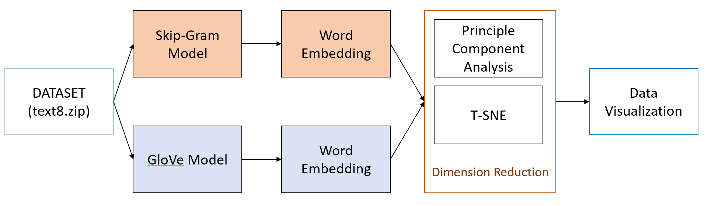

# NLP.Word_Embedding
This repository is for independent project on Recent Developments in Word Embedding, directed by Prof. Nevin Zhang. My independent project is to enhance my understanding of word embedding models, like skip-gram model and GloVe model, by reimplementing those two models. Secondly, I try out some chatbot codes and build a warm chatbot to relief upset people. Finally, I summarize some papers to answer two questions "What kind of space should the languages in?" and "What kind of operator should be used in word embedding?".

**[Report](https://github.com/yansenhan/NLP.Word_Embedding/blob/master/Report.pdf) Here !**

# Project Details
## PART I: The Reimplements of Classical Word Embeddings Models
**Project Architecture:**

- **Data Source:** [text8.zip](http://mattmahoney.NET/dc/text8.zip)
- **Google Implementation of GloVe Model:** [Google GloVe Model Code](https://colab.research.google.com/github/mdda/deep-learning-workshop/blob/master/notebooks/5-RNN/3-Text-Corpus-and-Embeddings.ipynb#scrollTo=LusgTEmtqTK5)
- [Code - PART I](https://github.com/yansenhan/NLP.Word_Embedding/tree/master/PART%201): Skip-gram model and GloVe model in TensorFlow

## PART II: Warm ChatBot (Seq2seq)
- **Data Source:** [STC3](http://coai.cs.tsinghua.edu.cn/hml/challenge/dataset_description/)
- [Code - PART II](https://github.com/yansenhan/NLP.Word_Embedding/tree/master/PART%202): Warm ChatBot. The final result is very frustrating.
- The code is mainly from the Pytorch tutorial. I only change the dataset and make a little modification.

## PART III: Papers Review
- [Report](https://github.com/yansenhan/NLP.Word_Embedding/blob/master/Report.pdf)
- [Presentation Slides](https://github.com/yansenhan/NLP.Word_Embedding/blob/master/Presentation_PPT.pdf)

# Results
## GloVe Word Embeddings (PCA)

## Stupid Warm ChatBot

# Acknowledgement
I am very grateful to [Prof. Nevin Zhang](https://www.cse.ust.hk/faculty/lzhang/) and my friends. Thanks a lot for your support and help.
